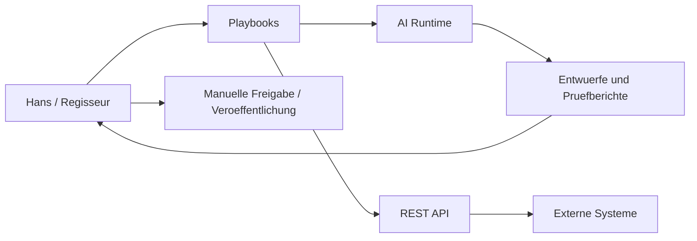

# System Architecture

Die Digiwiz Knowledge Platform beschreibt die Soll-Architektur und Entscheidungsgrundlagen fuer das bestehende Digiwiz-System.

## Architekturueberblick

## Komponenten

- Knowledge Layer: Dokumentation, Playbooks, Schemas, ADRs.
- Quality Layer: Validierung, Review-Checklisten, Quellenpruefung.
- Interface Layer: CLI und REST API.
- AI Runtime: Assistenz fuer Recherche, Strukturierung, Varianten und Pruefung.
- Integration Layer: WordPress, LinkedIn, Quellen, Bilddienste und spaetere MCP-Server.

## Grundregeln

- Playbooks steuern Verhalten, nicht verstreute Prompt-Fragmente.
- REST-Endpunkte bilden stabile Integrationsgrenzen.
- MCP wird vorbereitet, aber nicht als erste Abhaengigkeit eingefuehrt.
- Jede neue Faehigkeit muss rueckwaertskompatibel beschrieben werden.
